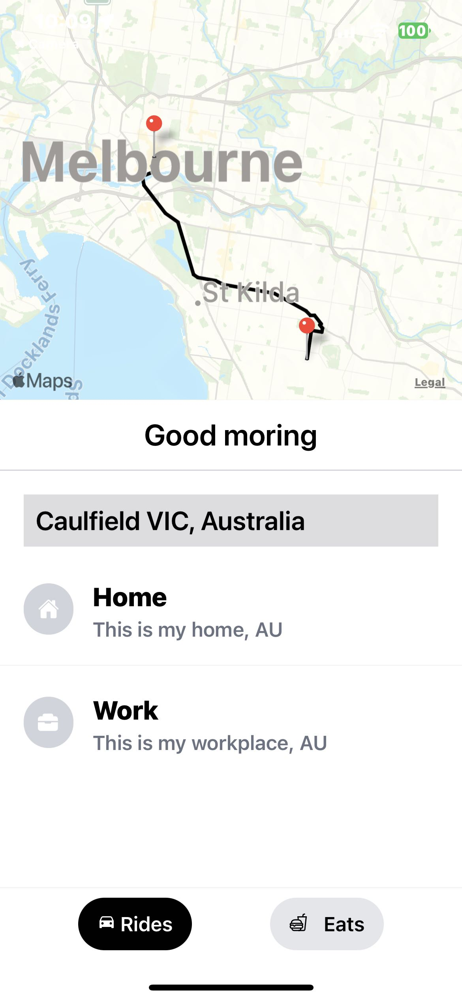

# ReactNativeUber

I am using Expo to create an Uber clone mobile app. I am utilizing Redux as my data management system and the Google Maps API to implement various functionalities.

.homePage

.googleAutoComplete

.mapDisplay

.PriceFeature
